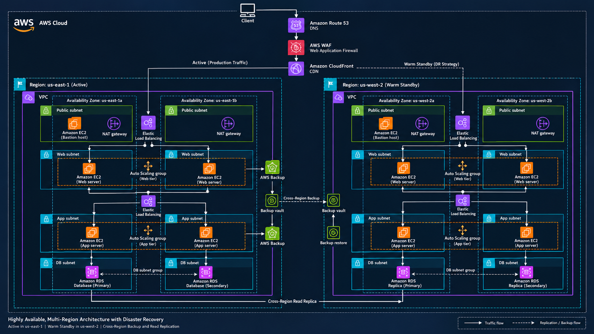

# AWS Multi-Region Highly Available Web Application with Disaster Recovery

## 1. Introduction

This document provides the detailed technical documentation for an AWS multi-region highly available web application architecture.

The objective of this project is to design an infrastructure that can provide:

- High Availability
- Fault Tolerance
- Scalability
- Security
- Backup and Recovery
- Disaster Recovery
- Multi-Region Resilience

The architecture consists of a primary AWS region and a secondary disaster recovery region.

---

# 2. Project Objectives

The major objectives of this project are:

1. Design a highly available AWS infrastructure.
2. Distribute application resources across multiple Availability Zones.
3. Implement load balancing for application traffic.
4. Automatically scale EC2 instances based on workload.
5. Keep application and database resources in private subnets.
6. Implement security using Security Groups and IAM roles.
7. Protect the web application using AWS WAF.
8. Improve content delivery using CloudFront.
9. Implement DNS management using Route 53.
10. Design a secondary AWS region for disaster recovery.
11. Implement backup and recovery mechanisms.
12. Reduce application downtime during infrastructure failures.

---

# 3. Architecture Overview



The architecture contains two AWS regions:

| Region | Role |
|---|---|
| `us-east-1` | Primary / Production |
| `us-west-2` | Secondary / Disaster Recovery |

The primary region handles normal traffic.

The secondary region provides disaster recovery capability in case the primary region experiences a major failure.

---

# 4. High-Level Traffic Flow

The application request follows this architecture:

```text
User
  ↓
Route 53
  ↓
AWS WAF
  ↓
CloudFront
  ↓
Application Load Balancer
  ↓
Web Tier
  ↓
Application Tier
  ↓
RDS Database
